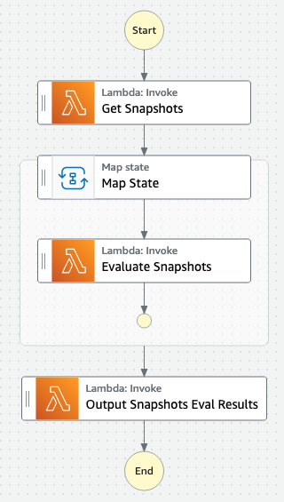

# Amazon EBS Snapshot Tiering Evaluator

This sample was written to enable evaulation of AWS spend associated with moving an Amazon EBS Snapshot from Amazon EBS Standard Tier to Amazon EBS Archive Tier storage. The main output of this utility is the estimated AWS cost assosciated with the target snapshot in both Standard and Archive tiers.

When you archive a snapshot, the incremental snapshot is converted to a full snapshot, and it is moved from the standard tier to the Amazon EBS Snapshots Archive tier (archive tier). Full snapshots include all of the blocks that were written to the volume at the time when the snapshot was created. The variance between incremental and full snapshots means effective up-front cost analysis can become an important factor to consider.

This data is a valuable input to decision making around whether EBS Snapshot Archival makes sense for a particular snapshot or group of spahosts (e.g. is it cost effective). Whilst this is one input, other criteria (such as regulatory and compliance requirements) should be factored in when using Amazon EBS Snapshots Archive for low-cost, long-term storage of snapshots.

This code closely aligns with the steps for determining the reduction in standard tier storage costs outlined in the [AWS Documentation](https://docs.aws.amazon.com/AWSEC2/latest/UserGuide/archiving-guidelines.html#archive-guidelines).

## Assumptions & Key Notes

- Pricing for Amazon EBS is based on GB-month.
- This sample works on a 30-day month.
- Snapshot storage within the Archive Tier currently charges a minimum of 90 days. As this utility compares pricing between EBS Standard Tier storage and the Archive Tier, we are using 3 months of storage (3x 30-day months) as our assumption and method of comparison.
- **Please Note:** This script calls Amazon EBS direct APIs for Snapshots which do have costs associated with their usage. Under standard usage, the costs associated with tool is not expected to raise any concerns (`ListChangedBlocks` and `ListSnapshotBlocks` API calls = $0.0006 per thousand requests - _as of August 2022_). Please make sure to review your expected usage of this script and the EBS Pricing available at: https://aws.amazon.com/ebs/pricing/
- This sample calls the AWS Pricing API in us-east-1 to dynamically source EBS snapshot storage pricing for the region.

## Prerequisites

- Python 3.9+
- AWS Account Credentials
- [AWS Cloud Development Kit (CDK)](https://aws.amazon.com/cdk/)
- Node.js 18.16.0+

## Quick Start (CLI Method)

**This Quick Start is best for one-off EBS snapshot evaluations.** This method can quickly become cumbersome for evaluation of many EBS Snapshots. For wide-scale evaluations, use the _Quick Start (AWS CDK Method)_.

_Assuming OSX/Linux - Adjust commands below to suit windows env (e.g. venv activation)_

- Clone this repo and enter directory.
- Setup Python Virtual Environment: `python3 -m venv venv`
- Activate the Virtual Environment: `. venv/bin/activate`
- Install the python requirements: `python -m pip install -r requirements.txt`
- Run the script: `python src/snapshot-evaluator.py --snapshot snap-xxxxx`

```text
$ python src/snapshot_evaluator.py -h
usage: snapshot_evaluator.py [-h] [-p PROFILE] [-r REGION] -s TARGET_SNAPSHOT [-v]

optional arguments:
  -h, --help            show this help message and exit
  -p PROFILE, --profile PROFILE
                        AWS Named Profile
  -r REGION, --region REGION
                        AWS Region (e.g. "us-east-1")
  -s TARGET_SNAPSHOT, --snapshot TARGET_SNAPSHOT
                        Target Snapshot ID for Evaluation
  -v, --verbose         (Optional) Display verbose logging (default: false)
```

### Sample CLI Run

Below is an example output from the tool (anonymized).

```
$ python src/snapshot_evaluator.py -s snap-22222222222222222
 ===== Starting Evaluation of target Snaphot Id: snap-22222222222222222 =====
Looking up region specific EBS snapshot pricing
Identified Standard Tier Pricing: $0.055 per GB-Month of snapshot data stored - Asia Pacific (Sydney)
Identified Archive Tier Pricing: $0.01375 per GB-Month of snapshot archive data stored - Asia Pacific (Sydney)
Step 1 - Determining the full size of the EBS snapshot...
Step 2 - Identifying the source EBS volume from the EBS snapshot...
Step 3 - Finding all snapshots of the source EBS volume...
Step 4 - Sorting the snapshots by created date...
Step 5 - Identifying any prior/following (surrounding) snapshots...
Step 5a - Snapshot Before Target Snapshot: snap-11111111111111111
Step 5a - Snapshot After Target Snapshot: snap-33333333333333333
Step 6 - Finding any unreferenced blocks in the target snapshot...
Step 6a - Identifying the current snapshot scenario...
Step 6a - Current Scenario: Both before and after snapshots to consider.
Step 6b - Getting changed blocks between previous and target snapshots...
Step 6b - Getting changed blocks between target snapshot and subsequent snapshot...
Step 7 - Comparing block indexes to identify unreferenced data in target snapshot...
Step 8 - Determining storage costs for this snapshot...
Step 8a - Determining storage costs - Standard tier...
Step 8b - Determining storage costs - Archive tier...
 ===== Evaluation Complete =====

 ===== Summary Report =====
Target Snapshot Id: snap-22222222222222222
Source EBS Volume ID: vol-0f419475aaaaaaaaa
EBS Volume Size: 100 GB
Approx. size of target snapshot: 10.447265625 GB
Approx. size of full snapshot (if moved to Archive Tier): 100 GB

Estimated 90-day cost of snapshot in Standard Tier (USD): $1.72
Estimated 90-day cost of snapshot in Archive Tier (USD): $4.12
```

## Quick Start (AWS CDK Method)

This method will deploy an [AWS Step Functions](https://aws.amazon.com/step-functions/) State Machine to evaluate all EBS Snapshots within the region and AWS Account that it is deployed in. This project consists of a few Lambda Functions, the State Machine and an output S3 bucket.

### Build

To build this app, you need to be in this sample's root folder. Then run the following:

```bash
$ npm install -g aws-cdk
$ npm install
$ npm run build
```

### Deploy

_Assuming you have your local environment setup with AWS Credentials:_

Run `cdk deploy`. This will deploy / redeploy your Stack to your AWS Account.

### Execute

In the AWS Management Console, navigate to the [AWS Step Functions](https://console.aws.amazon.com/states/home) page and select the State Machine you deployed.

_It should be named similar to the following: `SnapshotEvalStateMachine2AC33273-aaaOrPWres5H`_

**Start the Execution** of the state machine. State Machine input is not required (to accept defaults). If you would like to filter your snapshots for evaluation, see details below.

### State Machine Overview

This state machine performs a scale-out function to facilitate quick evaluation of EBS Snapshots within the deployed account/region.

<kbd>

</kbd>

#### Step 1 - Get Snapshots

The **Get Snapshots** task will query the API and generate a list of EBS Snapshots to process.

Be default, this sample will filter for all EBS snapshots which meet the criteria:

- Status = Completed
- Storage Tier = Standard
- Same Account and Region as the Lambda Function
- Owned by the current account

##### Custom EBS Snapshot Filter

You can optionally supply your own EBS Snapshot filter during invocation of the State Machine to more selectively target certain snapshots.
Ensure you encapsulate your custom array of filters in the `snapshot_filter` key. All other key names are ignored for this step.

Supply filters based upon the boto3 format detailed here: https://boto3.amazonaws.com/v1/documentation/api/latest/reference/services/ec2.html#EC2.Client.describe_snapshots

**Please Note:** It is highly recommended you include the `storage-tier` and `status` filters listed in the example below, and append your custom filters past that.

**Pro Tip:** State Machine input wants JSON formatting, this differs from the single-quotes used in the boto3 documentation.

The following JSON example provides a starting point for building your custom snapshot filter.

```json
{
  "snapshot_filter": [
    {
      "Name": "storage-tier",
      "Values": ["standard"]
    },
    {
      "Name": "status",
      "Values": ["completed"]
    },
    {
      "Name": "REPLACE_ME",
      "Values": ["REPLACE_ME"]
    }
  ]
}
```

#### Step 2 - Iterate and Evaluate

For each snapshot returned we map a single snapshot per **Evaluate Snapshots** Lambda invocation.

**Note** The **Default Max Concurrency** of the state machine is set to `20`. This default limit is in place to restrict potential impacts to [AWS Lambda concurrency limits](https://docs.aws.amazon.com/lambda/latest/dg/lambda-concurrency.html).

You can adjust this settin as required by manually editing the deployed State Machine or updating the `_CONCURRENT_SNAPSHOT_EVALUATIONS` constant in the CDK definition (`index.ts`). If you update the CDK definition file, you will need to redeploy the CDK solution (`cdk deploy`)).

#### Step 3 - Output Results

For ease of use, we collate all the results and push these to a CSV file in S3. Download this file for your analysis.

**NB** For ease of use, the output step within the step function includes the specific path that the CSV is uploaded to in S3.

## Security

See [CONTRIBUTING](CONTRIBUTING.md#security-issue-notifications) for more information.

## License

This library is licensed under the MIT-0 License. See the LICENSE file.
