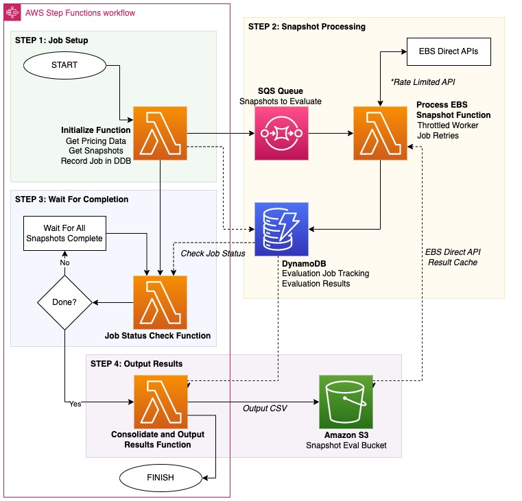

# Amazon EBS Snapshot Tiering Evaluator

This sample was written to enable "What If" cost analysis associated with moving an Amazon EBS Snapshot from Amazon EBS Standard Tier to Amazon EBS Archive Tier storage. The main output of this solution is the estimated AWS cost assosciated with the target snapshot in both Standard and Archive tiers.

When you archive a snapshot, the incremental snapshot is converted to a full snapshot, and it is moved from the standard tier to the Amazon EBS Snapshots Archive tier (archive tier). Full snapshots include all of the blocks that were written to the volume at the time when the snapshot was created. The variance between incremental and full snapshots means effective up-front cost analysis can become an important factor to consider.

This data is a valuable input to decision making around whether EBS Snapshot Archival makes sense for a particular snapshot or group of spahosts (e.g. is it cost effective). Whilst this is one input, other criteria (such as regulatory and compliance requirements) should be factored in when using Amazon EBS Snapshots Archive for low-cost, long-term storage of snapshots.

This code closely aligns with the steps for determining the reduction in standard tier storage costs outlined in the [AWS Documentation](https://docs.aws.amazon.com/AWSEC2/latest/UserGuide/archiving-guidelines.html#archive-guidelines).

## Assumptions & Key Notes

- Pricing for Amazon EBS is based on GB-month.
- This sample works on a 30-day month.
- Snapshot storage within the Archive Tier currently charges a minimum of 90 days. As this solution compares pricing between EBS Standard Tier storage and the Archive Tier, we are using 3 months of storage (3x 30-day months) as our assumption and method of comparison.
- **Please Note:** This script calls Amazon EBS direct APIs for Snapshots which do have costs associated with their usage. Under standard usage, the costs associated with tool is not expected to raise any concerns (`ListChangedBlocks` and `ListSnapshotBlocks` API calls). Please make sure to review your expected usage of this script and the EBS Pricing available at: https://aws.amazon.com/ebs/pricing/
- The `ListChangedBlocks` API is called for evaluation of snapshot blocks and is rate limited. This solution leverages a queue and worker process to work within these API constraints.
- This sample calls the AWS Pricing API in us-east-1 to dynamically source Amazon EBS snapshot storage pricing for the region.

## Prerequisites

- Python 3.9+
- AWS Account Credentials
- [AWS Cloud Development Kit (CDK)](https://aws.amazon.com/cdk/)
- Bootstrapped AWS Account (per https://docs.aws.amazon.com/cdk/v2/guide/bootstrapping.html)
- Node.js 18.16.0+

## Get Started (AWS CDK)

Use the following steps to deploy this sample solution into your AWS environment.
The following steps expect that your AWS target environment & associated credentials have been setup for deployment into your desired AWS Account & region.

### Build

To build this app, you need to be in this sample's root folder. Then run the following:

```bash
$ npm install -g aws-cdk
$ npm install
$ npm run build
```

### Deploy

_Assuming your local environment setup with AWS Credentials, targetting bootstrapped account/region._

Run `cdk deploy`. This will deploy / redeploy the EBS Snapshot Evaluator solution to your AWS Account.

### Execute

In the AWS Management Console, navigate to the [AWS Step Functions](https://console.aws.amazon.com/states/home) page and select the State Machine you deployed.

_Your exact State Machine is identified in the CloudFormation Stack Outputs. It should be named similar to the following: `SnapshotEvalStateMachine2AC33273-aaaOrPWres5H`_

**Start the Execution** of the state machine. State Machine input is not required (to accept defaults). If you would like to filter your snapshots for evaluation, see details below.

### State Machine Overview

This state machine performs a scale-out function to facilitate quick evaluation of EBS Snapshots within the deployed account/region.

<kbd>

</kbd>

#### Step 1 - Init Function

The **Init Function** establishes a new job run, obtains the relevant AWS pricing from the AWS Pricing API and also generates a list of EBS Snapshots in scope for this evaluation job.

Be default, this sample will filter for all EBS snapshots which meet the criteria:

- Status = Completed
- Storage Tier = Standard
- Same Account and Region as the Lambda Function
- Owned by the current account

All in scope snapshots are registered in the DynamoDB tables, and submitted to the solution's SQS queue for subsequent processing.

##### Custom EBS Snapshot Filter

You can optionally supply an Amazon EBS Snapshot filter to more selectively target certain snapshots. This section outlines the syntax and expected input that should be supplied in the State Machine Execution Input.
Ensure you encapsulate your custom array of filters in the `snapshot_filter` key. All other key names are ignored for this step.

Supply filters based upon the boto3 format detailed here: https://boto3.amazonaws.com/v1/documentation/api/latest/reference/services/ec2.html#EC2.Client.describe_snapshots

**Please Note:** It is highly recommended you include the `storage-tier` and `status` filters listed in the example below, and append your custom filters past that.

**Pro Tip:** State Machine input wants JSON formatting, this differs from the single-quotes used in the boto3 documentation.

The following JSON example provides a starting point for building your custom snapshot filter.

```json
{
  "snapshot_filter": [
    {
      "Name": "storage-tier",
      "Values": ["standard"]
    },
    {
      "Name": "status",
      "Values": ["completed"]
    },
    {
      "Name": "REPLACE_ME",
      "Values": ["REPLACE_ME"]
    }
  ]
}
```

#### Step 2 - Processing Wait Loop

While processing is underway (outside the scope of the State Machine) the state machine now enters into a wait loop. By default the state machine checks progress every minute.

You can track progress of the snapshot evaluation processing through a few mechanisms:

- The `CheckProcessingStatus` function provides a `num_jobs_pending` metric in its output you can monitor.
- Alternatively, you could watch the SQS Queue depth for any pending jobs.
- Alternatively, you could query the solution's `SnapshotEvalJobs` DynamoDB table which contains the status of all jobs.

The duration this solution stay in this processing wait loop depends on the number of snapshots in scope and the size (number of blocks changed).

##### Out of Band Processing

A Lambda Worker process is seutp behind the SQS Queue (concurrency limited) to process each of the in scope jobs.

This worker will:

- Pull job from SQS
- Query the EBS Direct APIs (+ cache)
- Evaluate the snapshot
- Emit results into Amazon DynamoDB tracking table

#### Step 3 - Output Results

Once all processing jobs have reported complete, we move onto the output results stage.

This Lambda function pulls and collate all the job results into a CSV file. This CSV file is pushed into the Snapshot Eval Bucket in Amazon S3. Download this file for your analysis. Of most note is the final few columns (which compare 90-day cost associated with each snapshot in either tier).

**NB** For ease of use, the output step within the step function includes the specific path that the CSV is uploaded to in S3.

## Security

See [CONTRIBUTING](CONTRIBUTING.md#security-issue-notifications) for more information.

## License

This library is licensed under the MIT-0 License. See the LICENSE file.
